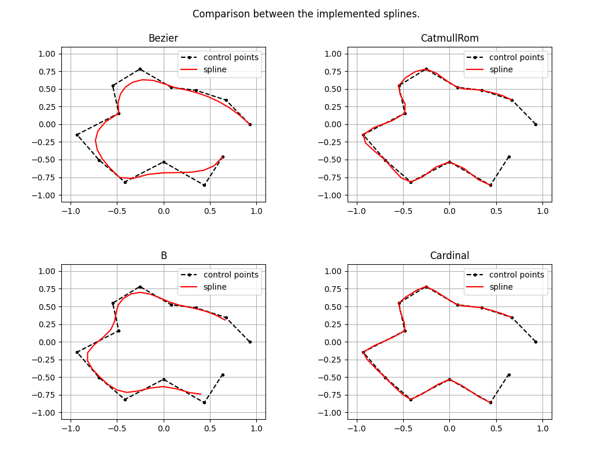

# Splines

A simple repository to construct some famous splines such as Catmull-Rom, B-spline, Cardinal etc.



## Introduction

I started playing with splines while developping robotics application as I often encountered trajectories that needed to be smoothed out or interpolated.

This implementation is quite minimalist and uses the following matrix form for all type of splines.

$$
\mathbf{P(t)} =
\begin{bmatrix}
    1 & t & t^2 & t^3
\end{bmatrix}
\mathbf{A}
\mathbf{P}
$$

where
- $t$ is the mixing parameter $\in [0,1]$
- $\mathbf{A} \in \mathbb{R}^{4 \times 4}$ is the weight matrix, also called the characteristic matrix.
- $\mathbf{P} \in \mathbb{R}^{4 \times n}$ is the control points matrix, with each row containing a control point of dimension n.
- $\mathbf{P(t)} \in \mathbb{R}^{1 \times n}$ is the resulting point.


## Getting Started

This repository only has two dependencies : numpy and matplotlib.

```sh
python3 -m pip install numpy matplotlib
```

### Usage

1. Clone the repository
    ```sh
    git clone https://github.com/lesurJ/Splines.git
    ```

2. Run the main script
   ```sh
   python3 main.py
   ```

3. Or use your own control points
    ```python
    import numpy as np

    if __name__=="__main__":
        # 1. Generate your own control points in dimension 2
        control_points = np.arange(26).reshape(-1,2)

        # 2. Define the spline to use
        spline = Bezier()

        # 3. Pick a single or multiple values for the mixing parameter
        u = 0.25
        u = np.linspace(0,1,100)

        # 4. Get the spline value as well as the tangents
        spline_points, spline_tangents = spline.get_spline(control_points, u)
    ```


### Remarks

The control points used in the main script are generated without any constraints on tangency and derivative continuity. The user should handle the constraints in the generation of the control points.

**Bézier** : The Bézier spline is a concatenation of cubic Bézier curves containing each 4 control points. In order to be smooth, some conditions needs to be met at the junctions (e.g the control points before and after the junction are symmetric).

**Catmull-Rom** : The Catmull-Rom is a special case of the cardinal spline with the scaling value set at $0.5$.


## License

Distributed under the MIT License. See the [license](LICENSE.md) for more information.
