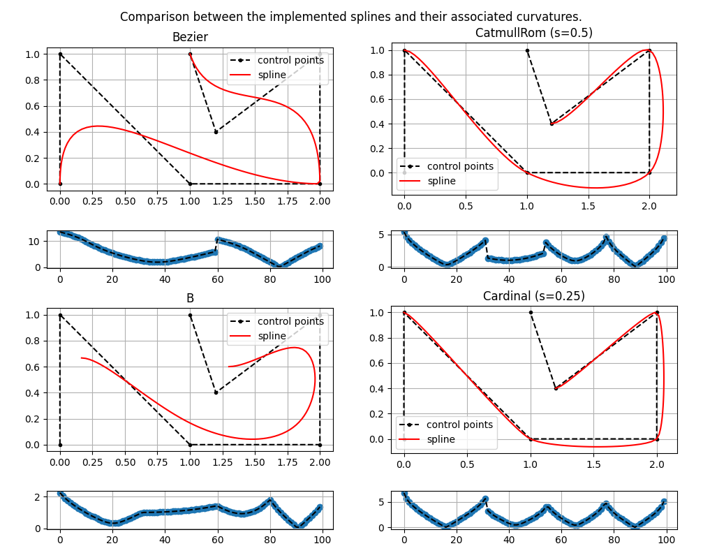
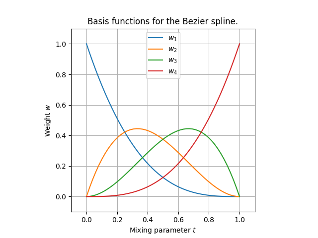

# Splines

A simple repository to construct some famous splines such as Catmull-Rom, B-spline, Cardinal etc.



## Introduction

I started playing with splines while developping robotics application as I often encountered trajectories that needed to be smoothed out or interpolated.

A spline is a continuous piece-wise function defined with polynomials that acts as a curve generator. The polynomials of the spline are defined by some coefficients that change the overall behavior of the curve. These coefficients are responsible for mixing the so-called $\textit{control points}$.

## Implementation

This implementation is quite minimalist and uses the following matrix form for all type of splines.

$$
\mathbf{P(t)} =
\begin{bmatrix}
    1 & t & t^2 & t^3
\end{bmatrix}
\mathbf{A}
\mathbf{P}
$$

where
- $t$ is the mixing parameter $\in [0,1]$
- $\mathbf{A} \in \mathbb{R}^{4 \times 4}$ is the characteristic matrix.
- $\mathbf{P} \in \mathbb{R}^{4 \times n}$ is the control points matrix, with each row containing a control point of dimension n.
- $\mathbf{P(t)} \in \mathbb{R}^{1 \times n}$ is the resulting point.

This implementation works for any dimension $n > 1$.

## Getting Started

This repository only has two dependencies : numpy and matplotlib.

```sh
python3 -m pip install numpy matplotlib
```

### Usage

1. Clone the repository
    ```sh
    git clone https://github.com/lesurJ/Splines.git
    ```

2. Run the main script
   ```sh
   python3 main.py
   ```

3. Or use your own control points
    ```python
    import numpy as np
    from splines import Bezier, CatmullRom, B, Cardinal

    if __name__=="__main__":
        # 1. Generate your own control points in dimension 2
        control_points = np.arange(26).reshape(-1,2)

        # 2. Define the spline to use
        spline = Bezier()
        # spline = CatmullRom()
        # spline = B()
        # spline = Cardinal()

        # 3. Pick a single or multiple values for the mixing parameter
        u = 0.25
        u = np.linspace(0,1,100)

        # 4. Get the spline points, tangents and curvature
        spline.compute_spline(control_points, u)
        spline_points = spline.get_spline_points()
        spline_tangents = spline.get_spline_tangents()
        spline_curvature = spline.get_spline_curvature()
    ```


## Remarks

The control points (CP) used in the main script are generated without any constraints on tangency and derivative continuity. The user should handle the constraints in the generation of the CP.

**Bézier** : The Bézier spline is a concatenation of cubic Bézier curves containing each 4 CP. In order to be smooth, some conditions needs to be met at the junctions (e.g the CP before and after the junction are symmetric). This implementation assumes there are no duplicates in the CP; meaning the first cubic bézier mixes $CP_i, i=0 \rightarrow 3$, the second cubic bézier mixes $CP_i, i=3 \rightarrow 6$ etc.

**Catmull-Rom** : The Catmull-Rom is a special case of the cardinal spline with the scaling value set at $0.5$.

**Reparameterization** : The reparameterization of the mixing parameter is implemented in the method ```reparameterize_mixing_parameter()```. Note that this feature is activated by default.

As explained [here](https://davis.wpi.edu/~matt/courses/biomed/reparam.htm), *a problem that exists with splines is that when given a linearly increasing t, the point does not progress through the curve at even intervals. To correct this problem we reparameterized the spline by sampling points and then linearly interpolating between those sample points.*

This behavior can be seen in the plot below.
.png)

A comparison between a spline with an uniform input parameter and a reparameterized one is shown below.


**Basis functions**
The basis functions for the splines can be found below. They can also be called with the method:
```python
spline.plot_basis_functions()
```
| Spline      | Basis Functions                    |
| ----------- | ---------------------------------- |
| Bezier      |      |
| Catmull-Rom |  |
| B           |           |
| Cardinal    |    |

## License

Distributed under the MIT License. See the [license](LICENSE.md) for more information.
